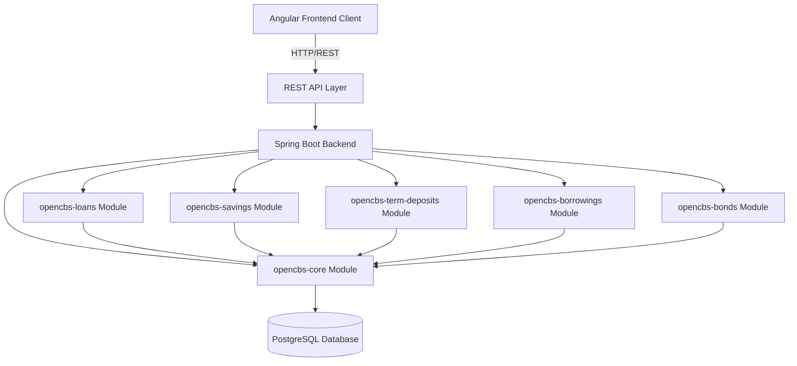
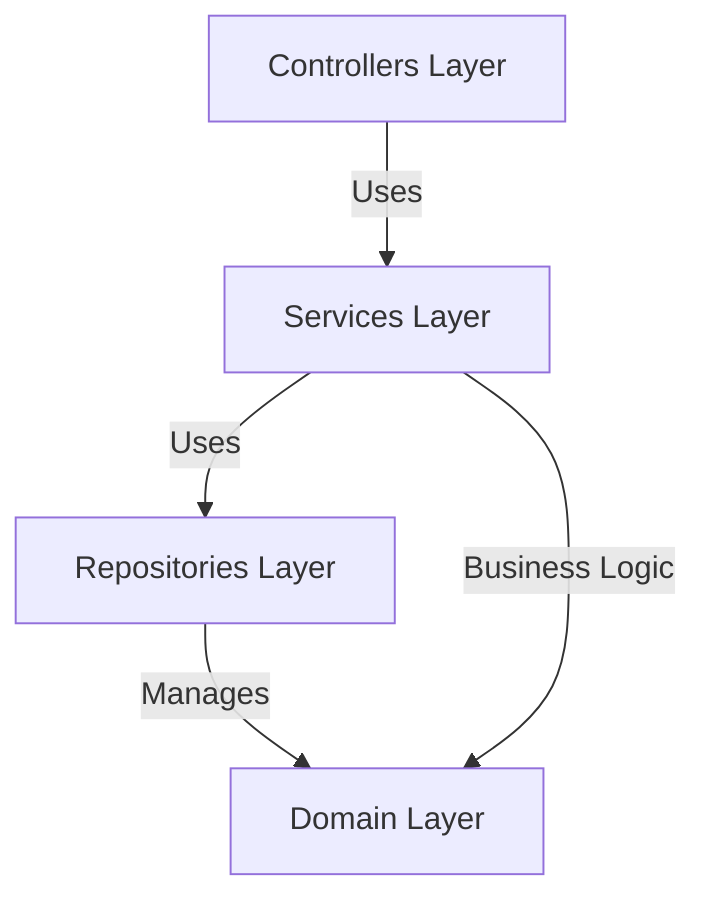
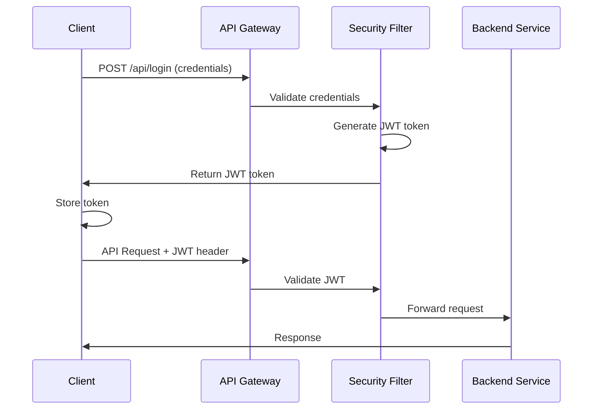
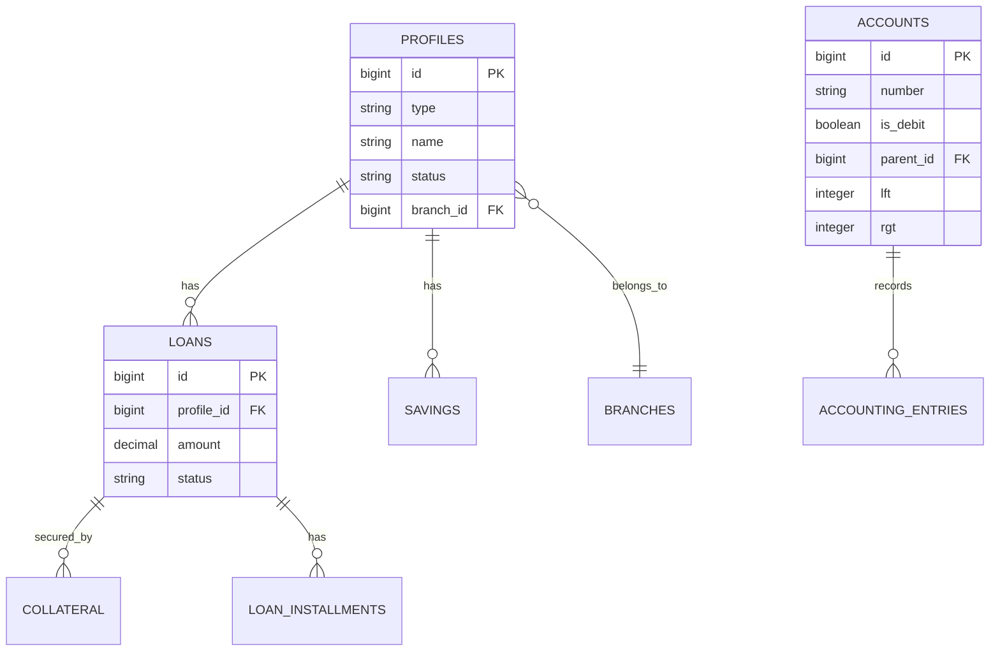

OpenCBS Cloud follows a modern, modular architecture with a clear separation between the backend server and frontend client. The system is built for scalability, maintainability, and cloud deployment.

## High-Level Architecture



The architecture consists of two main components:
- **Backend**: Multi-module Maven project built with Spring Boot
- **Frontend**: Single-page application built with Angular

## Backend Architecture

### Multi-Module Maven Structure

The backend is organized as a parent Maven project with specialized modules:

```xml
<groupId>com.opencbs</groupId>
<artifactId>opencbs-cloud</artifactId>
<version>0.0.1-SNAPSHOT</version>
<packaging>pom</packaging>

<modules>
    <module>opencbs-core</module>
    <module>opencbs-spring-boot-starter</module>
    <module>opencbs-server</module>
    <module>opencbs-borrowings</module>
    <module>opencbs-savings</module>
    <module>opencbs-term-deposits</module>
    <module>opencbs-bonds</module>
    <module>opencbs-loans</module>
</modules>
```

### Module Responsibilities

<Accordion title="opencbs-core">
**Foundation module** containing shared components used across all other modules:

- Domain entities (Account, Profile, Branch, User, Currency)
- Security configuration and JWT authentication
- Accounting engine and services
- Custom fields framework
- Audit trail infrastructure (Hibernate Envers)
- Common services and repositories
- Shared DTOs and mappers

All business modules depend on this core module.
</Accordion>

<Accordion title="opencbs-loans">
**Loan management module** handling the complete loan lifecycle:

- Loan application processing
- Schedule generation and management
- Disbursement processing
- Repayment tracking
- Collateral management
- Individual and group loan support
- Loan product configuration

```java
<dependency>
    <groupId>com.opencbs</groupId>
    <artifactId>opencbs-core</artifactId>
    <version>0.0.1-SNAPSHOT</version>
</dependency>
```
</Accordion>

<Accordion title="opencbs-savings">
**Savings account module** for deposit account management:

- Savings account lifecycle
- Transaction processing (deposits/withdrawals)
- Interest calculation and accrual
- Savings product configuration
- Account balancing
</Accordion>

<Accordion title="opencbs-term-deposits">
**Fixed-term deposit module** for time deposits:

- Term deposit account management
- Maturity processing
- Interest accrual automation
- Early withdrawal handling
- Renewal processing
</Accordion>

<Accordion title="opencbs-borrowings">
**Institutional borrowing module** for liability management:

- Borrowing tracking
- Repayment scheduling
- Interest calculation
- Liability reporting
</Accordion>

<Accordion title="opencbs-bonds">
**Bond management module** for debt securities:

- Bond issuance
- Installment tracking
- Interest payment processing
- Bond lifecycle management
</Accordion>

<Accordion title="opencbs-server">
**Main application module** that ties everything together:

- Spring Boot application entry point
- Module integration
- Application configuration
- Deployment packaging
</Accordion>

<Accordion title="opencbs-spring-boot-starter">
**Starter module** providing common Spring Boot configuration and utilities.
</Accordion>

## Technology Stack

### Backend Technologies

<CardGroup cols={2}>
  <Card title="Spring Boot 1.5.4" icon="leaf">
    Core application framework
  </Card>
  <Card title="Spring Data JPA" icon="database">
    Data persistence layer
  </Card>
  <Card title="Spring Security" icon="shield">
    Authentication and authorization
  </Card>
  <Card title="Hibernate" icon="box">
    ORM and Envers for auditing
  </Card>
</CardGroup>

### Key Backend Dependencies

```xml
<!-- Spring Boot -->
<parent>
    <groupId>org.springframework.boot</groupId>
    <artifactId>spring-boot-starter-parent</artifactId>
    <version>1.5.4.RELEASE</version>
</parent>

<!-- Core Dependencies -->
<dependencies>
    <dependency>
        <groupId>org.springframework.boot</groupId>
        <artifactId>spring-boot-starter-data-jpa</artifactId>
    </dependency>
    
    <dependency>
        <groupId>org.springframework.boot</groupId>
        <artifactId>spring-boot-starter-web</artifactId>
    </dependency>
    
    <dependency>
        <groupId>org.springframework.boot</groupId>
        <artifactId>spring-boot-starter-security</artifactId>
    </dependency>
    
    <dependency>
        <groupId>org.postgresql</groupId>
        <artifactId>postgresql</artifactId>
        <version>42.2.2.jre7</version>
    </dependency>
</dependencies>
```

### Backend Libraries

<Tabs>
  <Tab title="Database">
    - **PostgreSQL**: Primary database (version 42.2.2.jre7)
    - **Flyway**: Database migration management (4.0.3)
    - **Hibernate Envers**: Audit trail and versioning
    - **QueryDSL**: Type-safe query construction (4.2.1)
  </Tab>
  <Tab title="Security">
    - **JWT (jjwt)**: Token-based authentication
    - **Spring Security**: Authorization framework
    - **Stateless sessions**: No server-side session storage
  </Tab>
  <Tab title="Documentation">
    - **Swagger/Springfox**: API documentation (2.9.2)
    - **Spring REST Docs**: Test-driven documentation
    - **OpenAPI 2.0**: API specification
  </Tab>
  <Tab title="Reporting">
    - **JasperReports**: Report generation (6.10.0)
    - **Apache POI**: Excel file generation (3.17)
    - **iText/XMLWorker**: PDF generation (5.5.12)
    - **Thymeleaf**: Template engine for reports (3.0.11)
  </Tab>
  <Tab title="Utilities">
    - **Lombok**: Boilerplate code reduction
    - **MapStruct**: DTO mapping (1.4.2)
    - **Apache Commons**: Utilities
    - **Joda-Time**: Date/time handling (2.9.9)
  </Tab>
</Tabs>

## Frontend Architecture

### Angular Single-Page Application

The client is built with Angular 8 using modern frontend practices:

```json
{
  "name": "opencbs-client",
  "version": "0.1.0",
  "dependencies": {
    "@angular/core": "^8.1.4",
    "@angular/material": "^8.2.3",
    "@ngrx/store": "^8.5.2",
    "@ngrx/effects": "^8.1.0",
    "rxjs": "6.5.3"
  }
}
```

### Frontend Structure

```
client/src/app/
├── containers/           # Feature modules
│   ├── accounting/       # Accounting UI
│   ├── auth/            # Authentication
│   ├── bonds/           # Bond management
│   ├── borrowing/       # Borrowings
│   ├── configuration/   # System settings
│   ├── dashboard/       # Main dashboard
│   ├── loan/            # Loan management
│   ├── loan-application/# Loan applications
│   ├── maker-checker/   # Approval workflows
│   ├── profile/         # Client profiles
│   ├── reports/         # Reporting
│   ├── savings/         # Savings accounts
│   ├── teller-management/# Teller operations
│   └── term-deposit/    # Term deposits
├── core/                # Core services
│   ├── services/        # Shared services
│   ├── store/          # NgRx state management
│   ├── guards/         # Route guards
│   └── models/         # TypeScript models
└── shared/             # Shared components
```

### Frontend Technologies

<CardGroup cols={2}>
  <Card title="Angular 8" icon="angular">
    Component-based framework
  </Card>
  <Card title="Angular Material" icon="palette">
    UI component library
  </Card>
  <Card title="NgRx" icon="box-archive">
    State management with Redux pattern
  </Card>
  <Card title="RxJS" icon="arrows-spin">
    Reactive programming
  </Card>
</CardGroup>

### Key Frontend Dependencies

<Tabs>
  <Tab title="Core">
    - **@angular/core**: Framework core (8.1.4)
    - **@angular/router**: Routing (8.1.4)
    - **@angular/forms**: Forms management (8.1.4)
    - **@angular/common**: Common utilities (8.1.4)
  </Tab>
  <Tab title="State Management">
    - **@ngrx/store**: State container (8.5.2)
    - **@ngrx/effects**: Side effects (8.1.0)
    - **@ngrx/router-store**: Router integration (8.0.0)
    - **@ngrx/store-devtools**: Developer tools (8.0.0)
  </Tab>
  <Tab title="UI/UX">
    - **@angular/material**: Material Design (8.2.3)
    - **@angular/cdk**: Component Dev Kit (8.1.4)
    - **ngx-lightning**: Salesforce Design System (1.0.2)
    - **primeng**: Additional components (7.0.0)
    - **ngx-toastr**: Toast notifications (10.2.0)
  </Tab>
  <Tab title="Utilities">
    - **moment**: Date manipulation (2.24.0)
    - **lodash**: Utility functions (4.17.4)
    - **big.js**: Decimal arithmetic (3.1.3)
    - **file-saver**: File downloads (1.3.3)
    - **pdfmake**: PDF generation (0.1.57)
  </Tab>
</Tabs>

## Layered Architecture

### Backend Layers



<Steps>
  <Step title="Controller Layer">
    REST endpoints exposing API functionality. Handle HTTP requests/responses and delegate to services.
    
    ```java
    @RestController
    @RequestMapping(value = "/api/group-loans")
    public class GroupLoanController extends BaseController {
        @Autowired
        private LoanWorker loanWorker;
        
        @GetMapping(value = "/{loanApplicationId}")
        public LoanDto get(@PathVariable long loanApplicationId) {
            // Delegate to service layer
        }
    }
    ```
  </Step>
  
  <Step title="Service Layer">
    Business logic implementation. Orchestrate operations across repositories and enforce business rules.
    
    Services include: `AccountService`, `LoanApplicationService`, `ProfileService`, etc.
  </Step>
  
  <Step title="Repository Layer">
    Data access using Spring Data JPA. Type-safe queries with QueryDSL.
    
    ```java
    public interface AccountRepository extends JpaRepository<Account, Long> {
        // Custom queries defined here
    }
    ```
  </Step>
  
  <Step title="Domain Layer">
    Entity models representing business concepts with JPA annotations.
  </Step>
</Steps>

### Frontend Layers

<Steps>
  <Step title="Components">
    UI components built with Angular. Smart components connect to store, presentational components receive data via inputs.
  </Step>
  
  <Step title="Services">
    HTTP services communicating with backend API. Business logic services for complex operations.
  </Step>
  
  <Step title="State Management (NgRx)">
    Centralized state with actions, reducers, effects, and selectors following Redux pattern.
  </Step>
  
  <Step title="Routing & Guards">
    Route configuration with authentication guards protecting secured routes.
  </Step>
</Steps>

## Security Architecture

### Authentication Flow



### Security Configuration

```java
@Configuration
@EnableWebSecurity
public class WebSecurityConfiguration extends WebSecurityConfigurerAdapter {
    
    @Override
    protected void configure(HttpSecurity httpSecurity) throws Exception {
        httpSecurity
            .csrf().disable()
            .sessionManagement()
            .sessionCreationPolicy(SessionCreationPolicy.STATELESS)
            .and()
            .authorizeRequests()
            .antMatchers("/api/login").permitAll()
            .anyRequest().authenticated();
        
        httpSecurity.addFilterBefore(
            authenticationTokenFilterBean(), 
            UsernamePasswordAuthenticationFilter.class
        );
    }
}
```

<Note>
The system uses **stateless JWT authentication** - no server-side sessions are maintained, enabling horizontal scaling.
</Note>

## Data Architecture

### Database Schema

OpenCBS Cloud uses **PostgreSQL** as its primary database with a well-normalized schema:

- **Single-table inheritance** for polymorphic entities (Profiles, Custom Fields)
- **Nested set model** for hierarchical accounts (lft/rgt columns)
- **Audit tables** managed by Hibernate Envers
- **Flyway migrations** for version-controlled schema changes

### Entity Relationships



## Integration Architecture

### REST API

All backend functionality is exposed via RESTful endpoints:

- **Base URL**: `/api/`
- **Authentication**: JWT token in Authorization header
- **Content-Type**: `application/json`
- **Documentation**: Swagger UI at `/swagger-ui.html`

### Message Queue Integration

RabbitMQ integration for asynchronous processing and external system integration:

```xml
<dependency>
    <groupId>org.springframework.amqp</groupId>
    <artifactId>spring-rabbit</artifactId>
</dependency>
```

<Warning>
WebSocket support via STOMP is available for real-time updates to connected clients.
</Warning>

## Deployment Architecture

### Cloud-Optimized Design

The application is designed for cloud deployment with:

- **Stateless application tier** - enables horizontal scaling
- **Containerization ready** - can be packaged in Docker
- **Database migrations** - automated via Flyway
- **Environment configuration** - externalized via Spring Boot properties

### Build Process

```bash
# Backend build (Maven)
cd server
mvn clean package

# Frontend build (Angular CLI)
cd client
npm install
npm run build-prod
```

## Extensibility Points

<CardGroup cols={2}>
  <Card title="Custom Fields" icon="puzzle-piece">
    Add fields to any entity without schema changes
  </Card>
  <Card title="Product Configuration" icon="sliders">
    Define loan, savings, and deposit products
  </Card>
  <Card title="Report Templates" icon="file-lines">
    JasperReports and Excel templates
  </Card>
  <Card title="API Integration" icon="plug">
    RESTful API for external systems
  </Card>
</CardGroup>

## Performance Considerations

<Accordion title="Database Optimization">
  - QueryDSL for efficient queries
  - Lazy loading on relationships
  - Index optimization on frequently queried columns
  - Connection pooling via HikariCP
</Accordion>

<Accordion title="Caching">
  - Spring Cache abstraction ready
  - Hibernate second-level cache support
  - Application-level caching for static data
</Accordion>

<Accordion title="Frontend Performance">
  - Lazy loading of feature modules
  - AOT compilation for production builds
  - OnPush change detection strategy
  - Virtual scrolling for large lists
</Accordion>
