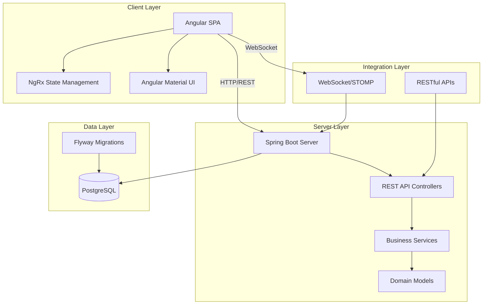
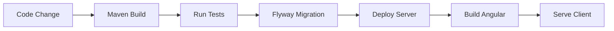

## System Architecture

OpenCBS Cloud is a modern, cloud-native Core Banking System built with a clean separation between frontend and backend layers. The architecture follows industry best practices for scalability, maintainability, and performance.


## Architecture Diagram



## Technology Stack

<CardGroup cols={2}>
  <Card title="Frontend" icon="browser">
    - **Framework**: Angular 8.x
    - **State Management**: NgRx (Redux pattern)
    - **UI Components**: Angular Material, Salesforce Lightning Design System
    - **Real-time**: STOMP/WebSocket
    - **HTTP Client**: Angular HttpClient with JWT interceptors
  </Card>
  
  <Card title="Backend" icon="server">
    - **Framework**: Spring Boot 1.5.4
    - **Language**: Java 8
    - **Build Tool**: Maven (multi-module)
    - **Database**: PostgreSQL 9.4+
    - **Migrations**: Flyway
    - **ORM**: Spring Data JPA
  </Card>
</CardGroup>

## Communication Patterns

### REST API Communication

The client communicates with the server primarily through RESTful APIs:

- **Authentication**: JWT-based authentication with token refresh
- **Request/Response**: JSON format
- **Interceptors**: Automatic header injection for authorization
- **Error Handling**: Centralized error handling with user-friendly messages

```typescript
// Example: HTTP interceptor adds JWT token
export class HttpHeaderInterceptor implements HttpInterceptor {
  intercept(req: HttpRequest<any>, next: HttpHandler) {
    const token = this.jwtService.getToken();
    const cloned = req.clone({
      headers: req.headers.set('Authorization', `Bearer ${token}`)
    });
    return next.handle(cloned);
  }
}
```

### Real-time Updates

For real-time features (notifications, live updates), OpenCBS uses:

- **Protocol**: STOMP over WebSocket
- **Library**: `@stomp/ng2-stompjs`
- **Use Cases**: Event notifications, system alerts, live data updates

## Architectural Layers

<Tabs>
  <Tab title="Presentation Layer">
    ### Angular Frontend
    
    - **Component-based architecture**: Reusable UI components
    - **Container/Presentational pattern**: Smart containers manage state, dumb components render UI
    - **Routing**: Angular Router with lazy-loaded modules
    - **Forms**: Reactive forms with custom validators
    
    **Key Directories:**
    - `client/src/app/containers/` - Feature modules (loans, savings, etc.)
    - `client/src/app/core/` - Core services and state management
    - `client/src/app/shared/` - Shared components and utilities
  </Tab>
  
  <Tab title="Application Layer">
    ### Spring Boot Backend
    
    - **Controllers**: REST API endpoints (`@RestController`)
    - **Services**: Business logic implementation
    - **DTOs**: Data Transfer Objects for API contracts
    - **Mappers**: Entity-DTO conversion
    - **Validators**: Input validation logic
    
    **Package Structure:**
    ```
    com.opencbs.{module}
    ├── controllers/
    ├── services/
    ├── domain/
    ├── dto/
    ├── mappers/
    ├── repositories/
    └── validators/
    ```
  </Tab>
  
  <Tab title="Domain Layer">
    ### Domain Models
    
    - **Entities**: JPA entities mapped to database tables
    - **Domain Services**: Core business logic
    - **Repositories**: Data access layer (Spring Data JPA)
    - **Events**: Domain events for audit trails
    
    **Core Domains:**
    - Loans
    - Savings
    - Borrowings
    - Term Deposits
    - Bonds
    - Accounting
  </Tab>
  
  <Tab title="Data Layer">
    ### PostgreSQL Database
    
    - **Migration Tool**: Flyway for version control
    - **Schema Organization**: Module-based schemas
    - **Transactions**: ACID compliance
    - **Audit Trail**: Comprehensive logging of all changes
    
    **Migration Paths:**
    - `server/*/src/main/resources/db/migration/`
  </Tab>
</Tabs>

## Key Design Principles

### 1. Separation of Concerns

Each module handles a specific domain:
- `opencbs-core` - Shared functionality, authentication, profiles
- `opencbs-loans` - Loan management
- `opencbs-savings` - Savings accounts
- `opencbs-borrowings` - Borrowing operations
- `opencbs-term-deposits` - Term deposit products
- `opencbs-bonds` - Bond management

### 2. Domain-Driven Design

The system organizes code around business domains rather than technical layers, making it easier to understand and maintain.

### 3. Scalability

- **Modular Architecture**: Independent modules can be scaled separately
- **Stateless Backend**: Horizontal scaling capability
- **Database Optimization**: Proper indexing and query optimization

### 4. Security

- **Authentication**: JWT-based with role-based access control (RBAC)
- **Authorization**: Fine-grained permissions system
- **Audit Trail**: Complete tracking of all operations
- **Data Encryption**: Sensitive data protection

## Development Workflow



### Build Process

1. **Backend**: Maven multi-module build
2. **Database**: Flyway migrations run automatically
3. **Frontend**: Angular CLI build with optimization
4. **Deployment**: Containerized deployment ready

## Next Steps

<CardGroup cols={2}>
  <Card title="Backend Structure" icon="java" href="/development/backend-structure">
    Explore the Spring Boot backend architecture
  </Card>
  
  <Card title="Frontend Structure" icon="angular" href="/development/frontend-structure">
    Learn about the Angular application structure
  </Card>
  
  <Card title="Database Schema" icon="database" href="/development/database-schema">
    Understand the database design
  </Card>
  
  <Card title="API Reference" icon="code" href="/api/overview">
    Browse the REST API documentation
  </Card>
</CardGroup>
