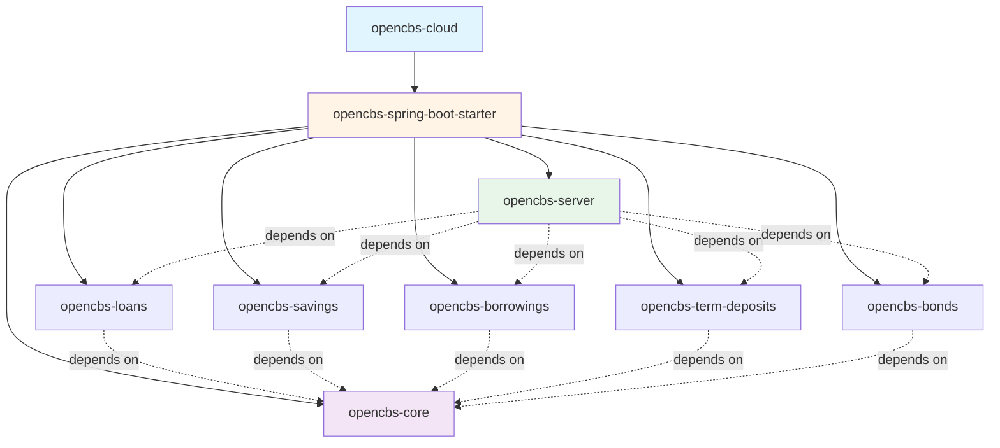

## Maven Multi-Module Structure

OpenCBS Cloud uses a Maven multi-module project structure to organize code into logical, reusable components. This approach promotes modularity, code reuse, and clear dependency management.

### Module Hierarchy



## Module Overview

<Tabs>
  <Tab title="opencbs-server">
    ### Main Application Module
    
    The executable Spring Boot application that aggregates all other modules.
    
    **Key Components:**
    - `ServerApplication.java` - Main entry point
    - Aggregates all functional modules
    - Contains frontend build integration
    
    ```java
    @SpringBootApplication
    @EnableAsync
    @ComponentScan("com.opencbs")
    @EntityScan("com.opencbs")
    @EnableScheduling
    public class ServerApplication {
        public static void main(String[] args) {
            SpringApplication.run(ServerApplication.class, args);
        }
    }
    ```
    
    **Dependencies:**
    - opencbs-loans
    - opencbs-savings
    - opencbs-borrowings
    - opencbs-term-deposits
    - opencbs-bonds
    
    **Location:** `server/opencbs-server/`
  </Tab>
  
  <Tab title="opencbs-core">
    ### Core Module
    
    Provides shared functionality used across all other modules.
    
    **Responsibilities:**
    - Authentication & Authorization
    - User & Role Management
    - Profile Management (Clients, Groups, Companies)
    - Accounting Engine
    - Audit Trail
    - Custom Fields
    - Branch Management
    - Global Settings
    - Reporting Infrastructure
    
    **Package Structure:**
    ```
    com.opencbs.core
    ├── accounting/          # Chart of accounts, transactions
    ├── analytics/           # Reporting and analytics
    ├── annotations/         # Custom annotations
    ├── aspects/             # AOP aspects
    ├── audit/               # Audit trail functionality
    ├── configs/             # Spring configuration
    ├── controllers/         # REST controllers
    │   ├── branches/
    │   └── profiles/
    ├── domain/              # Core entities
    ├── dto/                 # Data transfer objects
    ├── mappers/             # Entity-DTO mappers
    ├── repositories/        # Data access layer
    ├── services/            # Business logic
    └── validators/          # Input validation
    ```
    
    **Location:** `server/opencbs-core/`
  </Tab>
  
  <Tab title="opencbs-loans">
    ### Loans Module
    
    Handles all loan-related functionality.
    
    **Features:**
    - Loan Products
    - Loan Applications (Individual & Group)
    - Loan Disbursement
    - Repayment Schedules
    - Interest Calculation
    - Penalties & Fees
    - Loan Events & History
    - Collateral Management
    
    **Key Entities:**
    - `LoanApplication`
    - `GroupLoanApplication`
    - `Loan`
    - `LoanProduct`
    - `LoanInstallment`
    - `LoanEvent`
    
    **Location:** `server/opencbs-loans/`
  </Tab>
  
  <Tab title="opencbs-savings">
    ### Savings Module
    
    Manages savings accounts and transactions.
    
    **Features:**
    - Savings Products
    - Account Opening
    - Deposits & Withdrawals
    - Interest Accrual
    - Account Statements
    - Transaction History
    
    **Location:** `server/opencbs-savings/`
  </Tab>
  
  <Tab title="opencbs-borrowings">
    ### Borrowings Module
    
    Handles institutional borrowing operations.
    
    **Features:**
    - Borrowing Products
    - Borrowing Creation
    - Repayment Management
    - Interest Calculation
    - Accounting Integration
    
    **Location:** `server/opencbs-borrowings/`
  </Tab>
  
  <Tab title="opencbs-term-deposits">
    ### Term Deposits Module
    
    Manages fixed-term deposit accounts.
    
    **Features:**
    - Term Deposit Products
    - Account Creation
    - Maturity Handling
    - Interest Calculation
    - Early Withdrawal
    
    **Location:** `server/opencbs-term-deposits/`
  </Tab>
  
  <Tab title="opencbs-bonds">
    ### Bonds Module
    
    Handles bond issuance and management.
    
    **Features:**
    - Bond Products
    - Bond Issuance (ISIN generation)
    - Coupon Payments
    - Bond Installments
    - Interest Accrual
    - Accounting Integration
    
    **Key Entities:**
    - `BondsProduct`
    - `Bond`
    - `BondsInstallment`
    - `BondsEvent`
    
    **Location:** `server/opencbs-bonds/`
  </Tab>
  
  <Tab title="opencbs-spring-boot-starter">
    ### Parent Configuration
    
    Provides common Spring Boot configuration for all modules.
    
    **Responsibilities:**
    - Dependency version management
    - Common Spring Boot dependencies
    - Build plugin configuration
    - Profile configuration
    
    **Key Technologies:**
    - Spring Boot 1.5.4
    - Spring Cloud Dalston.SR1
    - PostgreSQL 9.4+
    - Lombok
    - JasperReports 6.10.0
    
    **Location:** `server/opencbs-spring-boot-starter/`
  </Tab>
</Tabs>

## Package Organization Pattern

Each functional module follows a consistent package structure:

```
com.opencbs.{module}
├── controllers/         # REST API endpoints
│   └── *Controller.java
├── domain/              # JPA entities
│   └── *.java
├── dto/                 # Data Transfer Objects
│   ├── *Dto.java
│   └── *Request.java
├── mappers/             # Entity-DTO conversion
│   └── *Mapper.java
├── repositories/        # Spring Data repositories
│   ├── *Repository.java
│   └── customs/         # Custom repository implementations
├── services/            # Business logic
│   ├── *Service.java
│   └── impl/
├── validators/          # Input validation
│   └── *Validator.java
└── configs/             # Module-specific configuration
    └── *Config.java
```

### Layer Responsibilities

<CardGroup cols={2}>
  <Card title="Controllers" icon="network-wired">
    **Purpose:** Handle HTTP requests and responses
    
    - REST endpoints (`@RestController`)
    - Request mapping (`@GetMapping`, `@PostMapping`, etc.)
    - DTO validation (`@Valid`)
    - HTTP status codes
    - Swagger/API documentation
    
    **Example:**
    ```java
    @RestController
    @RequestMapping("/api/loans")
    public class LoanController {
        @PostMapping
        public ResponseEntity<LoanDto> create(
            @Valid @RequestBody LoanRequest request) {
            // ...
        }
    }
    ```
  </Card>
  
  <Card title="Services" icon="cogs">
    **Purpose:** Implement business logic
    
    - Business rules enforcement
    - Transaction management (`@Transactional`)
    - Orchestrate repository calls
    - Domain event publishing
    - Integration with other modules
    
    **Example:**
    ```java
    @Service
    public class LoanService {
        @Transactional
        public Loan create(LoanDto dto) {
            // Business logic
        }
    }
    ```
  </Card>
  
  <Card title="Repositories" icon="database">
    **Purpose:** Data access layer
    
    - Spring Data JPA repositories
    - Custom queries (JPQL, native SQL)
    - Pagination and sorting
    - Query methods
    
    **Example:**
    ```java
    public interface LoanRepository 
        extends JpaRepository<Loan, Long> {
        
        List<Loan> findByProfileId(Long profileId);
        
        @Query("SELECT l FROM Loan l WHERE ...")
        List<Loan> customQuery();
    }
    ```
  </Card>
  
  <Card title="Mappers" icon="exchange-alt">
    **Purpose:** Convert between entities and DTOs
    
    - Entity to DTO mapping
    - DTO to Entity mapping
    - Partial updates
    - Nested object mapping
    
    **Example:**
    ```java
    @Service
    public class LoanMapper {
        public LoanDto mapToDto(Loan entity) {
            // Mapping logic
        }
        
        public Loan mapToEntity(LoanDto dto) {
            // Mapping logic
        }
    }
    ```
  </Card>
</CardGroup>

## Spring Boot Features

### Configuration

<Tabs>
  <Tab title="Application Configuration">
    **application.properties / application.yml**
    
    - Database connection settings
    - Server port configuration
    - Logging levels
    - Module-specific settings
    
    ```properties
    spring.datasource.url=jdbc:postgresql://localhost:5432/opencbs
    spring.datasource.username=postgres
    spring.jpa.hibernate.ddl-auto=validate
    spring.flyway.enabled=true
    ```
  </Tab>
  
  <Tab title="Component Scanning">
    **Auto-discovery of Spring components**
    
    The main application scans all `com.opencbs` packages:
    
    ```java
    @ComponentScan("com.opencbs")
    @EntityScan("com.opencbs")
    ```
    
    This discovers:
    - `@Controller`, `@RestController`
    - `@Service`
    - `@Repository`
    - `@Component`
    - `@Configuration`
  </Tab>
  
  <Tab title="Async Processing">
    **Asynchronous task execution**
    
    ```java
    @EnableAsync
    public class ServerApplication { }
    ```
    
    Enables `@Async` methods for background processing:
    - Report generation
    - Email notifications
    - Batch operations
  </Tab>
  
  <Tab title="Scheduled Tasks">
    **Cron-based scheduling**
    
    ```java
    @EnableScheduling
    public class ServerApplication { }
    ```
    
    Supports `@Scheduled` tasks:
    - Interest accrual
    - Day closure
    - Automated reports
  </Tab>
</Tabs>

## Database Migrations

Each module manages its own database schema through Flyway migrations.

**Migration Structure:**
```
server/
├── opencbs-core/src/main/resources/db/migration/core/
├── opencbs-loans/src/main/resources/db/migration/loans/
├── opencbs-savings/src/main/resources/db/migration/savings/
├── opencbs-borrowings/src/main/resources/db/migration/borrowings/
├── opencbs-term-deposits/src/main/resources/db/migration/term-deposits/
└── opencbs-bonds/src/main/resources/db/migration/bonds/
```

**Naming Convention:**
- `V{version}__{description}.sql`
- Example: `V1__Create_loans_table.sql`

See [Database Schema](/development/database-schema) for more details.

## API Architecture

### RESTful Design

- **Resource-based URLs**: `/api/loans`, `/api/savings`
- **HTTP Methods**: GET, POST, PUT, PATCH, DELETE
- **Status Codes**: Proper use of 2xx, 4xx, 5xx codes
- **JSON Format**: Request and response bodies

### Security

- **JWT Authentication**: Token-based auth
- **Role-Based Access Control**: Fine-grained permissions
- **Method Security**: `@PreAuthorize` annotations

### Error Handling

- **Global Exception Handler**: `@ControllerAdvice`
- **Custom Exceptions**: Domain-specific errors
- **Structured Responses**: Consistent error format

## Build and Deployment

### Maven Build

```bash
# Build all modules
mvn clean install

# Build specific module
mvn clean install -pl opencbs-loans

# Skip tests
mvn clean install -DskipTests
```

### Running the Application

```bash
# From opencbs-server directory
mvn spring-boot:run

# Or run the JAR
java -jar target/opencbs-server-*.jar
```

## Next Steps

<CardGroup cols={2}>
  <Card title="Architecture Overview" icon="sitemap" href="/development/architecture-overview">
    See the full system architecture
  </Card>
  
  <Card title="Database Schema" icon="database" href="/development/database-schema">
    Explore the database structure
  </Card>
  
  <Card title="API Development" icon="code" href="/api/overview">
    Learn how to build APIs
  </Card>
  
  <Card title="Testing" icon="flask" href="/development/testing">
    Backend testing strategies
  </Card>
</CardGroup>
