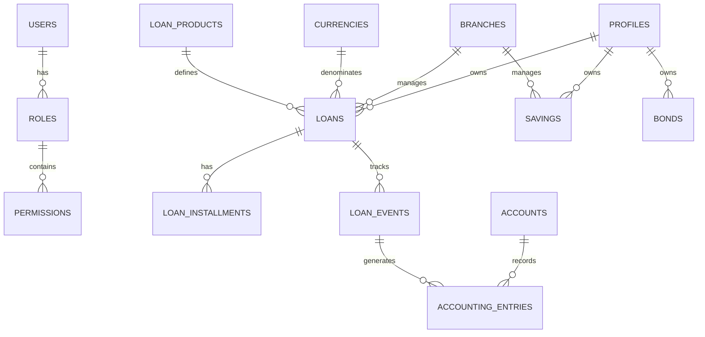

## Database Overview

OpenCBS Cloud uses **PostgreSQL** as its relational database management system. The schema is organized into modular sections corresponding to each functional module, with migrations managed by **Flyway**.

### Key Characteristics

<CardGroup cols={2}>
  <Card title="Database Engine" icon="database">
    - **PostgreSQL 9.4+**
    - ACID compliance
    - Advanced indexing
    - JSON support
    - Full-text search
  </Card>
  
  <Card title="Migration Management" icon="code-branch">
    - **Flyway** for versioning
    - Module-based migrations
    - Repeatable migrations
    - Version tracking
  </Card>
  
  <Card title="Schema Organization" icon="sitemap">
    - Module-based tables
    - Foreign key constraints
    - Audit trail tables
    - Sequence generators
  </Card>
  
  <Card title="Data Integrity" icon="shield-alt">
    - Referential integrity
    - Check constraints
    - Unique constraints
    - NOT NULL enforcement
  </Card>
</CardGroup>

## Migration Structure

Each module maintains its own migration files:

```
server/
├── opencbs-core/src/main/resources/db/migration/core/
│   ├── V100__Adjust_permissions_and_roles_table.sql
│   ├── V101__Add_get_balance_functions.sql
│   ├── V102__Make_adjustment_on_till.sql
│   └── ...
├── opencbs-loans/src/main/resources/db/migration/loans/
│   ├── V10__add_field_into_specific_provisions_entries.sql
│   ├── V11__update_loan_products_early_repayment_fee.sql
│   └── ...
├── opencbs-savings/src/main/resources/db/migration/savings/
├── opencbs-borrowings/src/main/resources/db/migration/borrowings/
├── opencbs-term-deposits/src/main/resources/db/migration/term-deposits/
└── opencbs-bonds/src/main/resources/db/migration/bonds/
```

### Migration Naming Convention

```
V{version}__{description}.sql
```

**Examples:**
- `V1__Create_core_tables.sql`
- `V2__Add_bonds_product.sql`
- `V10__add_branchid.sql`

## Core Schema

### Entity Relationship Overview



## Key Tables by Module

<Tabs>
  <Tab title="Core Tables">
    ### Authentication & Authorization
    
    **users**
    - User account information
    - Authentication credentials
    - User status and metadata
    
    ```sql
    CREATE TABLE users (
      id BIGSERIAL PRIMARY KEY,
      username VARCHAR(255) NOT NULL UNIQUE,
      password VARCHAR(255) NOT NULL,
      email VARCHAR(255),
      first_name VARCHAR(255),
      last_name VARCHAR(255),
      role_id BIGINT REFERENCES roles(id),
      branch_id BIGINT REFERENCES branches(id),
      enabled BOOLEAN DEFAULT TRUE,
      created_at TIMESTAMP NOT NULL,
      created_by_id BIGINT REFERENCES users(id)
    );
    ```
    
    **roles**
    - Role definitions
    - Role hierarchy
    
    **permissions**
    - Fine-grained permissions
    - Action-based authorization
    
    **roles_permissions**
    - Many-to-many relationship
    - Role permission assignments
    
    ```sql
    CREATE TABLE roles_permissions (
      role_id INT NOT NULL,
      permission_id INT NOT NULL,
      CONSTRAINT roles_permissions_role_id_permission_id_key 
        UNIQUE (role_id, permission_id),
      FOREIGN KEY (role_id) REFERENCES roles(id),
      FOREIGN KEY (permission_id) REFERENCES permissions(id)
    );
    ```
    
    ### Profiles
    
    **profiles**
    - Client/customer information
    - Person, group, or company profiles
    - Custom field support
    
    **branches**
    - Branch/office information
    - Organizational structure
    
    **currencies**
    - Supported currencies
    - Exchange rates
    
    ### Accounting
    
    **accounts**
    - Chart of accounts
    - Account hierarchy
    - Account types and balances
    
    **accounting_entries**
    - Double-entry bookkeeping
    - Debit and credit entries
    - Transaction tracking
    
    ```sql
    CREATE TABLE accounting_entries (
      id BIGSERIAL PRIMARY KEY,
      debit_account_id BIGINT REFERENCES accounts(id),
      credit_account_id BIGINT REFERENCES accounts(id),
      amount NUMERIC(12, 2) NOT NULL,
      effective_at TIMESTAMP NOT NULL,
      created_at TIMESTAMP NOT NULL,
      created_by_id BIGINT REFERENCES users(id),
      description TEXT,
      deleted BOOLEAN DEFAULT FALSE
    );
    ```
  </Tab>
  
  <Tab title="Loans Schema">
    ### Loan Products
    
    **loan_products**
    - Product definitions
    - Interest rates (min/max)
    - Maturity periods
    - Fee configurations
    - Early repayment settings
    
    ```sql
    ALTER TABLE loan_products
      ADD COLUMN early_partial_repayment_fee_type VARCHAR(50),
      ADD COLUMN early_partial_repayment_fee_value NUMERIC(12, 4),
      ADD COLUMN early_total_repayment_fee_type VARCHAR(50),
      ADD COLUMN early_total_repayment_fee_value NUMERIC(12, 4);
    ```
    
    ### Loan Applications
    
    **loan_applications**
    - Application workflow
    - Approval status
    - Application metadata
    
    ### Loans
    
    **loans**
    - Active loan contracts
    - Principal amount
    - Interest rate
    - Maturity date
    - Current status
    - Links to profile, product, branch
    
    **loan_installments**
    - Repayment schedule
    - Principal and interest breakdown
    - Payment tracking (paid vs. outstanding)
    - Maturity dates
    
    **loan_events**
    - Disbursement
    - Repayments
    - Penalties
    - Write-offs
    - Reschedules
    
    **loan_events_accounting_entries**
    - Links loan events to accounting entries
    - Ensures proper financial recording
    
    ### Provisions
    
    **loan_specific_provisions**
    - Loan loss provisioning
    - Risk assessment
    
    ```sql
    ALTER TABLE loan_specific_provisions
      ADD COLUMN is_rate BOOLEAN DEFAULT TRUE;
    ```
  </Tab>
  
  <Tab title="Bonds Schema">
    ### Bond Products
    
    **bonds_product**
    - Bond product definitions
    - Interest rate ranges
    - Maturity configurations
    - Coupon frequency
    
    ```sql
    CREATE TABLE bonds_product (
      id BIGSERIAL PRIMARY KEY,
      name VARCHAR(200) NOT NULL UNIQUE,
      code VARCHAR(32) NOT NULL UNIQUE,
      amount DECIMAL(16, 4) NOT NULL UNIQUE,
      number_min DECIMAL(16, 4) NOT NULL,
      number_max DECIMAL(16, 4) NOT NULL,
      interest_rate_min DECIMAL(8, 4) NOT NULL,
      interest_rate_max DECIMAL(8, 4) NOT NULL,
      coupon_frequency VARCHAR(32) NOT NULL,
      maturity_min INTEGER NOT NULL,
      maturity_max INTEGER NOT NULL,
      interest_scheme VARCHAR(200) NOT NULL,
      currency_id BIGINT NOT NULL REFERENCES currencies(id)
    );
    ```
    
    **bonds_product_accounts**
    - Account mappings for bond products
    - Links to chart of accounts
    
    ### Bonds
    
    **bonds**
    - Bond issuances
    - ISIN (International Securities Identification Number)
    - Principal amount
    - Interest rate
    - Maturity information
    - Status tracking
    
    ```sql
    CREATE TABLE bonds (
      id BIGSERIAL PRIMARY KEY,
      isin VARCHAR(32) NOT NULL UNIQUE,
      number INTEGER NOT NULL,
      amount NUMERIC(12, 2) NOT NULL,
      equivalent_amount NUMERIC(12, 2) NOT NULL,
      currency_id BIGINT NOT NULL,
      interest_rate NUMERIC(8,4) NOT NULL,
      created_at TIMESTAMP NOT NULL,
      value_date DATE NOT NULL,
      expire_date DATE NOT NULL,
      coupon_date DATE NOT NULL,
      frequency VARCHAR(32) NOT NULL,
      maturity INTEGER NOT NULL,
      interest_scheme VARCHAR(200) NOT NULL,
      status VARCHAR(32) NOT NULL,
      created_by_id BIGINT DEFAULT 1 NOT NULL,
      profile_id BIGINT NOT NULL,
      bank_account_id BIGINT NOT NULL,
      product_id BIGINT NOT NULL,
      branch_id BIGINT DEFAULT 1 NOT NULL,
      
      FOREIGN KEY (currency_id) REFERENCES currencies(id),
      FOREIGN KEY (created_by_id) REFERENCES users(id),
      FOREIGN KEY (profile_id) REFERENCES profiles(id),
      FOREIGN KEY (bank_account_id) REFERENCES accounts(id),
      FOREIGN KEY (product_id) REFERENCES bonds_product(id),
      FOREIGN KEY (branch_id) REFERENCES branches(id)
    );
    ```
    
    **bonds_installments**
    - Coupon payment schedule
    - Principal repayment tracking
    - Interest accrual
    
    ```sql
    CREATE TABLE bonds_installments (
      id BIGSERIAL PRIMARY KEY,
      bonds_id BIGINT NOT NULL,
      number INTEGER NOT NULL,
      maturity_date DATE NOT NULL,
      interest NUMERIC(12, 2) NOT NULL,
      principal NUMERIC(12, 2) NOT NULL,
      paid_principal NUMERIC(12, 2) DEFAULT 0 NOT NULL,
      paid_interest NUMERIC(12, 2) DEFAULT 0 NOT NULL,
      olb NUMERIC(12, 2) NOT NULL,
      last_accrual_date DATE NOT NULL,
      event_group_key BIGINT NULL,
      effective_at TIMESTAMP NOT NULL,
      deleted BOOLEAN,
      rescheduled BOOLEAN DEFAULT FALSE,
      
      FOREIGN KEY (bonds_id) REFERENCES bonds(id)
    );
    ```
    
    **bonds_events**
    - Bond lifecycle events
    - Coupon payments
    - Redemptions
    - Rollback tracking
    
    ```sql
    CREATE TABLE bonds_events (
      id BIGSERIAL PRIMARY KEY,
      event_type VARCHAR(200) NOT NULL,
      created_at TIMESTAMP NOT NULL,
      created_by_id BIGINT NOT NULL,
      bond_id BIGINT NOT NULL,
      effective_at TIMESTAMP NOT NULL,
      deleted BOOLEAN DEFAULT FALSE NOT NULL,
      installment_number INTEGER,
      amount NUMERIC(12, 2) DEFAULT 0 NOT NULL,
      group_key BIGINT DEFAULT 0 NOT NULL,
      comment VARCHAR(200),
      system BOOLEAN DEFAULT FALSE NOT NULL,
      rolled_back_by_id BIGINT,
      rolled_back_date TIMESTAMP,
      
      FOREIGN KEY (created_by_id) REFERENCES users(id),
      FOREIGN KEY (bond_id) REFERENCES bonds(id),
      FOREIGN KEY (rolled_back_by_id) REFERENCES users(id)
    );
    ```
    
    **bonds_events_accounting_entries**
    - Links bond events to accounting
  </Tab>
  
  <Tab title="Borrowings Schema">
    ### Borrowing Products
    
    **borrowing_products**
    - Institutional borrowing configurations
    - Interest schemes
    - Fee structures
    
    ### Borrowings
    
    **borrowings**
    - Borrowing contracts
    - Principal tracking
    - Interest calculation
    - Repayment schedules
    
    **borrowing_events**
    - Borrowing lifecycle tracking
    - Disbursement and repayment events
    
    **borrowing_installments**
    - Repayment schedule
    - Payment tracking
    
    ### Accounting Integration
    
    ```sql
    -- V10__Add_Borrowing_accounting.sql
    -- Links borrowing products to chart of accounts
    CREATE TABLE borrowing_product_accounts (
      id BIGSERIAL PRIMARY KEY,
      borrowing_product_id BIGINT REFERENCES borrowing_products(id),
      account_id BIGINT REFERENCES accounts(id),
      account_type VARCHAR(50) NOT NULL
    );
    ```
  </Tab>
  
  <Tab title="Savings & Term Deposits">
    ### Savings Products
    
    **savings_products**
    - Product configurations
    - Interest rates
    - Minimum balance requirements
    
    ### Savings Accounts
    
    **savings**
    - Account information
    - Current balance
    - Status
    
    **savings_transactions**
    - Deposits
    - Withdrawals
    - Interest postings
    
    ### Term Deposits
    
    **term_deposit_products**
    - Fixed-term configurations
    - Interest calculation methods
    
    **term_deposits**
    - Active term deposit contracts
    - Maturity handling
    - Early withdrawal penalties
  </Tab>
</Tabs>

## Common Patterns

### Audit Trail

Most tables include audit fields:

```sql
created_at TIMESTAMP NOT NULL,
created_by_id BIGINT REFERENCES users(id),
updated_at TIMESTAMP,
updated_by_id BIGINT REFERENCES users(id)
```

Some modules use dedicated audit tables:

```sql
CREATE SCHEMA audit;

CREATE TABLE audit.loan_products_history (
  -- Same columns as loan_products
  -- Plus revision tracking
  revision_id BIGSERIAL,
  revision_type VARCHAR(10), -- INSERT, UPDATE, DELETE
  revision_timestamp TIMESTAMP
);
```

### Soft Deletes

Many tables support soft deletion:

```sql
deleted BOOLEAN DEFAULT FALSE NOT NULL
```

### Event Sourcing

Financial events are tracked with group keys:

```sql
event_group_key BIGINT,
group_key BIGINT DEFAULT 0 NOT NULL
```

Sequence generators ensure uniqueness:

```sql
CREATE SEQUENCE bond_events_group_key;
```

### Foreign Key Constraints

Strict referential integrity:

```sql
ALTER TABLE bonds
  ADD CONSTRAINT bonds_branch_id_fkey
  FOREIGN KEY (branch_id) REFERENCES branches(id);
```

## Global Settings

Configuration stored in database:

```sql
CREATE TABLE global_settings (
  id BIGSERIAL PRIMARY KEY,
  name VARCHAR(255) NOT NULL UNIQUE,
  type VARCHAR(50) NOT NULL, -- TEXT, NUMBER, BOOLEAN, JSON
  value TEXT NOT NULL
);

INSERT INTO global_settings (name, type, value)
VALUES ('BONDS_CODE_PATTERN', 'TEXT', '"Bonds" + bonds_id');
```

## Migration Best Practices

### 1. Version Sequencing

Migrations run in version order:
- Core migrations: V100+
- Module migrations: V1+

### 2. Idempotent Operations

Safe re-runs with conditional logic:

```sql
ALTER TABLE loan_penalty_accounts
  DROP CONSTRAINT IF EXISTS loan_penalty_accounts_loan_application_penalty_id_fkey;
```

### 3. Data Preservation

Always preserve existing data:

```sql
ALTER TABLE bonds ADD COLUMN branch_id BIGINT DEFAULT 1 NOT NULL;
```

### 4. Backward Compatibility

Avoid breaking changes:
- Add columns instead of modifying
- Use DEFAULT values
- Maintain existing constraints

## Database Functions

PostgreSQL functions for complex operations:

```sql
-- V101__Add_get_balance_functions.sql
CREATE OR REPLACE FUNCTION get_account_balance(
  account_id BIGINT,
  as_of_date TIMESTAMP
) RETURNS NUMERIC AS $$
  -- Calculate balance from accounting entries
$$ LANGUAGE plpgsql;
```

## Performance Considerations

### Indexing Strategy

- Primary keys: Automatic B-tree indexes
- Foreign keys: Indexed for join performance
- Query optimization: Custom indexes on frequently queried columns

### Partitioning

Large tables (accounting_entries, events) may benefit from partitioning:

```sql
-- Time-based partitioning for historical data
CREATE TABLE accounting_entries_2024 
  PARTITION OF accounting_entries
  FOR VALUES FROM ('2024-01-01') TO ('2025-01-01');
```

## Next Steps

<CardGroup cols={2}>
  <Card title="Architecture Overview" icon="sitemap" href="/development/architecture-overview">
    See how the database fits into the system
  </Card>
  
  <Card title="Backend Structure" icon="server" href="/development/backend-structure">
    Understand how code interacts with the database
  </Card>
  
  <Card title="Database Development" icon="database" href="/development/backend-structure">
    Learn to create migrations
  </Card>
  
  <Card title="Data Model Guide" icon="table" href="/development/modules/core">
    Design new entities and relationships
  </Card>
</CardGroup>
