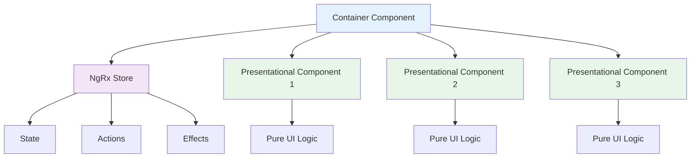
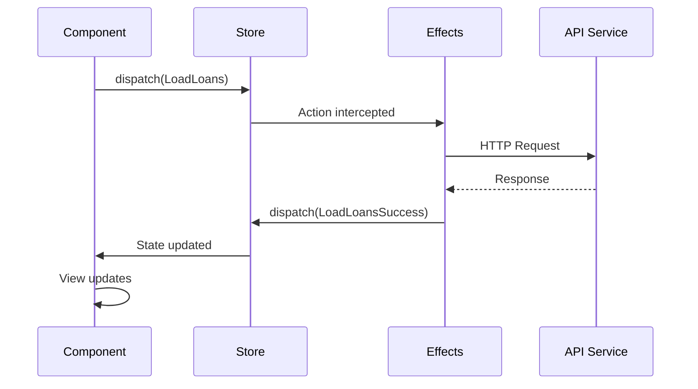

## Angular Application Overview

OpenCBS Cloud's frontend is built with **Angular 8.x**, featuring a modular architecture with state management, real-time communication, and a rich UI component library.

### Technology Stack

<CardGroup cols={2}>
  <Card title="Core Framework" icon="angular">
    - **Angular 8.1.4** - Core framework
    - **TypeScript 3.4.1** - Type-safe development
    - **RxJS 6.5.3** - Reactive programming
    - **Zone.js** - Change detection
  </Card>
  
  <Card title="State & Data" icon="database">
    - **NgRx 8.x** - Redux state management
    - **NgRx Effects** - Side effects handling
    - **NgRx Router Store** - Router state integration
    - **Immutable.js** - Immutable data structures
  </Card>
  
  <Card title="UI Components" icon="palette">
    - **Angular Material 8.2.3** - Material Design
    - **Salesforce Lightning Design** - Enterprise UI
    - **PrimeNG 7.0** - Rich components
    - **ngx-lightning** - Lightning components for Angular
  </Card>
  
  <Card title="Utilities" icon="toolbox">
    - **ngx-translate** - Internationalization
    - **ngx-toastr** - Toast notifications
    - **Moment.js** - Date manipulation
    - **PDFMake** - PDF generation
    - **File Saver** - File download
  </Card>
</CardGroup>

## Application Structure

```
client/src/app/
├── app.module.ts           # Root module
├── app.component.ts        # Root component
├── app-routing.module.ts   # Main routing
├── containers/             # Feature modules
│   ├── loan/
│   ├── loan-application/
│   ├── savings/
│   ├── borrowing/
│   ├── bonds/
│   ├── term-deposit/
│   ├── accounting/
│   ├── profile/
│   ├── settings/
│   ├── teller-management/
│   └── ...
├── core/                   # Core functionality
│   ├── components/
│   ├── services/
│   ├── store/              # NgRx state
│   ├── guards/
│   ├── directives/
│   ├── models/
│   └── utils/
└── shared/                 # Shared components
    ├── components/
    ├── directives/
    ├── pipes/
    └── modules/
```

## Architecture Patterns

### Container/Presentational Pattern



<Tabs>
  <Tab title="Container Components">
    ### Smart Components (Containers)
    
    Located in `containers/`, these components:
    
    - Connect to NgRx store
    - Dispatch actions
    - Handle routing
    - Manage business logic
    - Subscribe to state changes
    
    **Example Structure:**
    ```
    containers/loan/
    ├── loan-list/
    │   ├── loan-list.component.ts
    │   ├── loan-list.component.html
    │   └── loan-list.component.scss
    ├── loan-details/
    ├── loan-wrap/
    └── loan.routing.ts
    ```
    
    **Example Component:**
    ```typescript
    @Component({
      selector: 'cbs-loan-list',
      templateUrl: './loan-list.component.html'
    })
    export class LoanListComponent implements OnInit {
      loans$: Observable<Loan[]>;
      
      constructor(private store: Store<fromRoot.State>) {
        this.loans$ = this.store.pipe(
          select(fromStore.getLoans)
        );
      }
      
      ngOnInit() {
        this.store.dispatch(new fromStore.LoadLoans());
      }
    }
    ```
  </Tab>
  
  <Tab title="Presentational Components">
    ### Dumb Components
    
    Located in `shared/components/`, these components:
    
    - Receive data via `@Input()`
    - Emit events via `@Output()`
    - No direct store access
    - Reusable across features
    - Pure UI logic only
    
    **Example:**
    ```typescript
    @Component({
      selector: 'cbs-loan-card',
      templateUrl: './loan-card.component.html'
    })
    export class LoanCardComponent {
      @Input() loan: Loan;
      @Output() selected = new EventEmitter<Loan>();
      
      onSelect() {
        this.selected.emit(this.loan);
      }
    }
    ```
  </Tab>
</Tabs>

## State Management with NgRx

### Store Structure

The `core/store/` directory organizes state by feature:

```
core/store/
├── action.interface.ts
├── auth/
│   ├── auth.actions.ts
│   ├── auth.effects.ts
│   ├── auth.reducer.ts
│   └── auth.selectors.ts
├── loan/
│   ├── loan.actions.ts
│   ├── loan.effects.ts
│   ├── loan.reducer.ts
│   └── loan.selectors.ts
├── savings/
├── accounting-entries/
├── bonds/
├── borrowings/
└── ...
```

### NgRx Flow



<Tabs>
  <Tab title="Actions">
    ### Action Definitions
    
    Actions describe state changes:
    
    ```typescript
    // loan.actions.ts
    export enum LoanActionTypes {
      LOAD_LOANS = '[Loan] Load Loans',
      LOAD_LOANS_SUCCESS = '[Loan] Load Loans Success',
      LOAD_LOANS_FAIL = '[Loan] Load Loans Fail',
      CREATE_LOAN = '[Loan] Create Loan',
      // ...
    }
    
    export class LoadLoans implements Action {
      readonly type = LoanActionTypes.LOAD_LOANS;
    }
    
    export class LoadLoansSuccess implements Action {
      readonly type = LoanActionTypes.LOAD_LOANS_SUCCESS;
      constructor(public payload: Loan[]) {}
    }
    
    export type LoanActions = LoadLoans | LoadLoansSuccess | ...;
    ```
  </Tab>
  
  <Tab title="Reducers">
    ### State Reducers
    
    Pure functions that handle state transitions:
    
    ```typescript
    // loan.reducer.ts
    export interface LoanState {
      loans: Loan[];
      loading: boolean;
      loaded: boolean;
      error: any;
    }
    
    const initialState: LoanState = {
      loans: [],
      loading: false,
      loaded: false,
      error: null
    };
    
    export function reducer(
      state = initialState,
      action: LoanActions
    ): LoanState {
      switch (action.type) {
        case LoanActionTypes.LOAD_LOANS:
          return { ...state, loading: true };
          
        case LoanActionTypes.LOAD_LOANS_SUCCESS:
          return {
            ...state,
            loans: action.payload,
            loading: false,
            loaded: true
          };
          
        default:
          return state;
      }
    }
    ```
  </Tab>
  
  <Tab title="Effects">
    ### Side Effects Handler
    
    Manage async operations and side effects:
    
    ```typescript
    // loan.effects.ts
    @Injectable()
    export class LoanEffects {
      constructor(
        private actions$: Actions,
        private loanService: LoanService
      ) {}
      
      @Effect()
      loadLoans$ = this.actions$.pipe(
        ofType(LoanActionTypes.LOAD_LOANS),
        switchMap(() => {
          return this.loanService.getLoans().pipe(
            map(loans => new LoadLoansSuccess(loans)),
            catchError(error => of(new LoadLoansFail(error)))
          );
        })
      );
      
      @Effect()
      createLoan$ = this.actions$.pipe(
        ofType(LoanActionTypes.CREATE_LOAN),
        map((action: CreateLoan) => action.payload),
        switchMap(loan => {
          return this.loanService.create(loan).pipe(
            map(created => new CreateLoanSuccess(created)),
            catchError(error => of(new CreateLoanFail(error)))
          );
        })
      );
    }
    ```
  </Tab>
  
  <Tab title="Selectors">
    ### State Selectors
    
    Memoized state queries:
    
    ```typescript
    // loan.selectors.ts
    export const getLoanState = createFeatureSelector<LoanState>('loan');
    
    export const getLoans = createSelector(
      getLoanState,
      (state: LoanState) => state.loans
    );
    
    export const getLoansLoading = createSelector(
      getLoanState,
      (state: LoanState) => state.loading
    );
    
    export const getActiveLoan = createSelector(
      getLoans,
      (loans: Loan[], props: { id: number }) => 
        loans.find(loan => loan.id === props.id)
    );
    ```
  </Tab>
</Tabs>

## Feature Modules

The `containers/` directory contains feature-specific modules:

<CardGroup cols={2}>
  <Card title="Loan Module" icon="hand-holding-usd">
    **Location:** `containers/loan/`
    
    - Loan listing
    - Loan details
    - Repayment schedules
    - Transaction history
    - Loan events
  </Card>
  
  <Card title="Loan Application" icon="file-invoice">
    **Location:** `containers/loan-application/`
    
    - Application creation
    - Application workflow
    - Approval process
    - Document management
  </Card>
  
  <Card title="Savings Module" icon="piggy-bank">
    **Location:** `containers/savings/`
    
    - Account management
    - Transactions
    - Interest calculation
    - Account statements
  </Card>
  
  <Card title="Accounting" icon="calculator">
    **Location:** `containers/accounting/`
    
    - Chart of accounts
    - Journal entries
    - Balance sheet
    - Financial reports
  </Card>
  
  <Card title="Profile Module" icon="user">
    **Location:** `containers/profile/`
    
    - Client profiles
    - Group profiles
    - Company profiles
    - Custom fields
  </Card>
  
  <Card title="Settings" icon="cog">
    **Location:** `containers/settings/`
    
    - System configuration
    - User management
    - Roles & permissions
    - Global settings
  </Card>
</CardGroup>

## Core Services

The `core/services/` directory provides shared services:

```typescript
// Example: accounts.service.ts
@Injectable()
export class AccountsService {
  constructor(private http: HttpClient) {}
  
  getAccounts(): Observable<Account[]> {
    return this.http.get<Account[]>('/api/accounts');
  }
  
  getAccountById(id: number): Observable<Account> {
    return this.http.get<Account>(`/api/accounts/${id}`);
  }
}
```

**Key Services:**
- `accounts.service.ts` - Account operations
- `jwt.service.ts` - JWT token management
- `http-client-headers.service.ts` - HTTP header management
- `common.service.ts` - Common utilities
- `form-field-builder.service.ts` - Dynamic form generation
- `print-out.service.ts` - PDF/Print operations

## Routing Strategy

### Lazy Loading

Feature modules are lazy-loaded for optimal performance:

```typescript
// app-routing.module.ts
const routes: Routes = [
  {
    path: 'loans',
    loadChildren: () => import('./containers/loan/loan.module')
      .then(m => m.LoanModule)
  },
  {
    path: 'savings',
    loadChildren: () => import('./containers/savings/savings.module')
      .then(m => m.SavingsModule)
  },
  // ...
];
```

### Route Guards

```typescript
// core/guards/auth.guard.ts
@Injectable()
export class AuthGuard implements CanActivate {
  constructor(
    private store: Store<fromRoot.State>,
    private router: Router
  ) {}
  
  canActivate(): Observable<boolean> {
    return this.store.pipe(
      select(fromAuth.getIsAuthorized),
      tap(authorized => {
        if (!authorized) {
          this.router.navigate(['/login']);
        }
      })
    );
  }
}
```

## Forms Management

### Reactive Forms

OpenCBS uses Angular Reactive Forms extensively:

```typescript
export class LoanFormComponent implements OnInit {
  loanForm: FormGroup;
  
  constructor(private fb: FormBuilder) {}
  
  ngOnInit() {
    this.loanForm = this.fb.group({
      profileId: ['', Validators.required],
      productId: ['', Validators.required],
      amount: ['', [Validators.required, Validators.min(0)]],
      interestRate: ['', [Validators.required, Validators.min(0)]],
      maturity: ['', [Validators.required, Validators.min(1)]]
    });
  }
  
  onSubmit() {
    if (this.loanForm.valid) {
      this.store.dispatch(new CreateLoan(this.loanForm.value));
    }
  }
}
```

### Dynamic Form Builder

The `form-field-builder.service.ts` creates forms from configuration:

```typescript
// Dynamic field generation for custom fields
this.formFields = this.formFieldBuilder.build(fieldConfig);
```

## HTTP Communication

### Interceptors

```typescript
// http-header-interceptor.service.ts
@Injectable()
export class HttpHeaderInterceptor implements HttpInterceptor {
  constructor(private jwtService: JwtService) {}
  
  intercept(req: HttpRequest<any>, next: HttpHandler) {
    const token = this.jwtService.getToken();
    
    const cloned = req.clone({
      setHeaders: {
        Authorization: `Bearer ${token}`,
        'Content-Type': 'application/json'
      }
    });
    
    return next.handle(cloned).pipe(
      catchError(this.handleError)
    );
  }
}
```

## Real-time Communication

### WebSocket/STOMP

```typescript
import { StompService } from '@stomp/ng2-stompjs';

@Injectable()
export class NotificationService {
  constructor(private stompService: StompService) {}
  
  subscribe() {
    this.stompService.subscribe('/topic/notifications')
      .subscribe(message => {
        // Handle real-time notification
      });
  }
}
```

## Build & Development

### Development Server

```bash
cd client
npm install
npm start  # Runs on http://localhost:4200
```

### Production Build

```bash
npm run build-prod
# Output: client/dist/
```

### Key Scripts

- `npm start` - Development server
- `npm run build` - Development build
- `npm run build-prod` - Production build (optimized)
- `npm test` - Run unit tests
- `npm run lint` - Lint TypeScript

## Next Steps

<CardGroup cols={2}>
  <Card title="Architecture Overview" icon="sitemap" href="/development/architecture-overview">
    Understand the full system architecture
  </Card>
  
  <Card title="Backend Structure" icon="server" href="/development/backend-structure">
    Learn about the Spring Boot backend
  </Card>
  
  <Card title="Component Development" icon="puzzle-piece" href="/development/local-setup">
    Build Angular components
  </Card>
  
  <Card title="State Management" icon="layer-group" href="/development/architecture-overview">
    Master NgRx patterns
  </Card>
</CardGroup>
